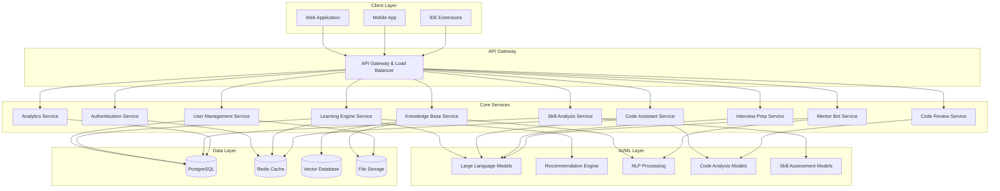

Design Document: Smart Dev Mentor

## Overview

Smart Dev Mentor is a comprehensive AI-powered platform that combines personalized learning experiences with intelligent developer productivity tools, specifically designed for the Indian market. The platform leverages modern AI/ML technologies including large language models, recommendation systems, and adaptive learning algorithms to create a unified ecosystem for technical skill development and professional growth.

The system architecture follows a microservices pattern with AI-first design principles, ensuring scalability, cost-effectiveness, and multilingual support. The platform integrates multiple AI components including natural language processing, code analysis, skill assessment, and personalized content recommendation to deliver a cohesive user experience.

## Architecture

### High-Level Architecture



### Deployment Architecture

The platform will be deployed on cloud infrastructure optimized for the Indian market:

- **Primary Region**: Mumbai (AWS ap-south-1) for data localization compliance
- **CDN**: CloudFront with edge locations across India for content delivery
- **Container Orchestration**: Amazon EKS for microservices management
- **Auto-scaling**: Horizontal pod autoscaling based on CPU/memory and custom metrics
- **Cost Optimization**: Spot instances for non-critical workloads, reserved instances for core services

## Components and Interfaces

### Learning Engine Service

**Purpose**: Manages personalized learning experiences and content recommendations

**Key Components**:
- **Adaptive Assessment Engine**: Evaluates user skills through interactive coding challenges
- **Content Recommendation System**: Uses collaborative filtering and content-based filtering
- **Progress Tracking Module**: Monitors learning milestones and skill development
- **Multilingual Content Manager**: Handles content translation and localization

**Interfaces**:
```typescript
interface LearningEngineAPI {
  assessSkillLevel(userId: string, domain: string): Promise<SkillAssessment>
  getPersonalizedContent(userId: string, preferences: LearningPreferences): Promise<Content[]>
  trackProgress(userId: string, activityId: string, performance: PerformanceData): Promise<void>
  generateLearningPath(userId: string, targetSkills: string[]): Promise<LearningPath>
}

interface SkillAssessment {
  userId: string
  domain: string
  level: SkillLevel
  strengths: string[]
  gaps: string[]
  confidence: number
  recommendations: string[]
}
```

### Code Assistant Service

**Purpose**: Provides real-time coding assistance and intelligent suggestions

**Key Components**:
- **Code Completion Engine**: Powered by fine-tuned code generation models
- **Error Detection and Explanation**: Analyzes code for bugs and provides educational feedback
- **Context-Aware Help System**: Understands project context and provides relevant assistance
- **Multi-language Support**: Handles explanations in multiple Indian languages

**Interfaces**:
```typescript
interface CodeAssistantAPI {
  getCodeSuggestions(context: CodeContext): Promise<CodeSuggestion[]>
  explainError(error: CodeError, language: string): Promise<ErrorExplanation>
  reviewCode(code: string, options: ReviewOptions): Promise<CodeReview>
  generateDocumentation(code: string, style: DocStyle): Promise<Documentation>
}

interface CodeSuggestion {
  text: string
  confidence: number
  explanation: string
  category: SuggestionType
}
```

### Skill Analysis Service

**Purpose**: Evaluates user capabilities and identifies learning opportunities

**Key Components**:
- **Multi-dimensional Skill Evaluator**: Assesses technical, problem-solving, and soft skills
- **Industry Benchmark Comparator**: Compares skills against Indian tech industry standards
- **Gap Analysis Engine**: Identifies specific areas for improvement
- **Career Path Recommender**: Suggests career trajectories based on current skills

**Interfaces**:
```typescript
interface SkillAnalysisAPI {
  analyzeSkills(userId: string, evidence: SkillEvidence[]): Promise<SkillProfile>
  compareToIndustry(skillProfile: SkillProfile, industry: string): Promise<BenchmarkReport>
  identifyGaps(currentSkills: SkillProfile, targetRole: string): Promise<SkillGap[]>
  recommendCareerPath(skillProfile: SkillProfile): Promise<CareerPath[]>
}

interface SkillProfile {
  userId: string
  technicalSkills: Map<string, SkillLevel>
  softSkills: Map<string, SkillLevel>
  experience: ExperienceData
  certifications: Certification[]
  lastUpdated: Date
}
```

### Mentor Bot Service

**Purpose**: Provides AI-powered mentorship and guidance

**Key Components**:
- **Conversational AI Engine**: Natural language understanding and generation
- **Knowledge Retrieval System**: Accesses curated knowledge base for accurate responses
- **Personality and Cultural Adaptation**: Adjusts communication style for Indian context
- **Session Management**: Maintains conversation context and learning history

**Interfaces**:
```typescript
interface MentorBotAPI {
  startConversation(userId: string, topic: string, language: string): Promise<ConversationSession>
  sendMessage(sessionId: string, message: string): Promise<MentorResponse>
  getGuidance(userId: string, challenge: Challenge): Promise<Guidance>
  provideFeedback(userId: string, work: UserWork): Promise<Feedback>
}

interface MentorResponse {
  message: string
  language: string
  suggestions: ActionSuggestion[]
  resources: Resource[]
  followUpQuestions: string[]
}
```

## Data Models

### User Profile Model

```typescript
interface UserProfile {
  id: string
  email: string
  name: string
  preferredLanguages: string[]
  location: Location
  educationLevel: EducationLevel
  experience: ExperienceLevel
  goals: LearningGoal[]
  preferences: UserPreferences
  skillProfile: SkillProfile
  learningHistory: LearningActivity[]
  achievements: Achievement[]
  createdAt: Date
  updatedAt: Date
}

interface UserPreferences {
  learningStyle: LearningStyle
  difficultyPreference: DifficultyLevel
  timeAvailability: TimeSlot[]
  notificationSettings: NotificationPreferences
  privacySettings: PrivacySettings
}
```

### Learning Content Model

```typescript
interface LearningContent {
  id: string
  title: string
  description: string
  type: ContentType
  difficulty: DifficultyLevel
  estimatedDuration: number
  prerequisites: string[]
  learningObjectives: string[]
  tags: string[]
  language: string
  content: ContentData
  assessments: Assessment[]
  metadata: ContentMetadata
  createdAt: Date
  updatedAt: Date
}

interface ContentData {
  text?: string
  code?: CodeExample[]
  videos?: VideoResource[]
  exercises?: Exercise[]
  quizzes?: Quiz[]
}
```

### Skill Assessment Model

```typescript
interface SkillAssessmentResult {
  id: string
  userId: string
  assessmentType: AssessmentType
  domain: string
  results: SkillMeasurement[]
  overallScore: number
  recommendations: Recommendation[]
  completedAt: Date
  validUntil: Date
}

interface SkillMeasurement {
  skill: string
  level: SkillLevel
  confidence: number
  evidence: Evidence[]
  improvementAreas: string[]
}
```

### Code Review Model

```typescript
interface CodeReviewResult {
  id: string
  userId: string
  codeSnippet: string
  language: string
  issues: CodeIssue[]
  suggestions: CodeSuggestion[]
  qualityScore: number
  learningPoints: LearningPoint[]
  reviewedAt: Date
}

interface CodeIssue {
  type: IssueType
  severity: Severity
  line: number
  column: number
  message: string
  explanation: string
  fixSuggestion: string
  learningResource?: Resource
}
```

Now I need to use the prework tool to analyze the acceptance criteria before writing the Correctness Properties section.

<function_calls>
<invoke name="prework">
<parameter name="featureName">smart-dev-mentor

## Correctness Properties

*A property is a characteristic or behavior that should hold true across all valid executions of a system鈥攅ssentially, a formal statement about what the system should do. Properties serve as the bridge between human-readable specifications and machine-verifiable correctness guarantees.*

Based on the prework analysis, I've identified several key properties that can be combined for comprehensive testing coverage. After reviewing for redundancy, the following properties provide unique validation value:

### Property 1: Skill Assessment Initiation
*For any* new user joining the platform, the Learning_Engine should initiate and complete a skill assessment process
**Validates: Requirements 1.1**

### Property 2: Learning Activity Progress Tracking
*For any* completed learning activity, the system should update the user's skill profile and modify future content recommendations accordingly
**Validates: Requirements 1.2**

### Property 3: Content Personalization
*For any* user request for learning content, the returned materials should match the user's skill level, learning style, and career goals
**Validates: Requirements 1.3**

### Property 4: Adaptive Learning Support
*For any* user struggling with a concept (indicated by poor performance), the system should provide alternative explanations and additional practice exercises
**Validates: Requirements 1.4**

### Property 5: Multilingual Content Delivery
*For any* user with a preferred Indian language setting, all content and interactions should be delivered in that language when multilingual support is enabled
**Validates: Requirements 1.5, 2.5, 7.5**

### Property 6: Real-time Code Assistance
*For any* code input by a user, the Code_Assistant should provide relevant suggestions, auto-completions, or error explanations
**Validates: Requirements 2.1, 2.2**

### Property 7: Contextual Help System
*For any* help request in a specific coding context, the Code_Assistant should provide relevant examples and explanations appropriate to that context
**Validates: Requirements 2.3**

### Property 8: Code Quality Analysis
*For any* submitted code, the Review_System should analyze it for bugs, security issues, and style violations, providing detailed explanations and improvement suggestions
**Validates: Requirements 4.1, 4.2, 4.3**

### Property 9: Positive Pattern Recognition
*For any* code review, the system should identify and explain positive patterns alongside issues, providing balanced educational feedback
**Validates: Requirements 4.4**

### Property 10: Multi-dimensional Skill Evaluation
*For any* completed coding exercise, the Skill_Analyzer should evaluate performance across multiple technical dimensions and generate comprehensive reports
**Validates: Requirements 3.1, 3.2**

### Property 11: Gap-based Learning Recommendations
*For any* identified skill gaps, the system should recommend specific learning paths and resources targeted at those gaps
**Validates: Requirements 3.3**

### Property 12: Industry Benchmarking
*For any* skill comparison request, the system should benchmark against Indian tech industry standards and provide relevant comparisons
**Validates: Requirements 3.5**

### Property 13: Interview Preparation Customization
*For any* interview preparation session, the system should customize questions and scenarios based on target role, company preferences, and Indian tech industry patterns
**Validates: Requirements 5.1, 5.2, 5.5**

### Property 14: Real-time Interview Feedback
*For any* answer provided during mock interviews, the system should provide immediate feedback on both technical accuracy and communication quality
**Validates: Requirements 5.3**

### Property 15: Documentation Intelligence
*For any* documentation creation or search, the Knowledge_Base should provide structure suggestions, relevant results from multiple sources, and maintenance recommendations
**Validates: Requirements 6.1, 6.2, 6.3**

### Property 16: Role-based Knowledge Recommendations
*For any* new team member with a specified role, the Knowledge_Base should recommend essential reading materials appropriate to that role
**Validates: Requirements 6.4**

### Property 17: Language Detection and Cultural Adaptation
*For any* user interaction, the Mentor_Bot should detect the preferred language, respond accordingly, and use culturally relevant examples
**Validates: Requirements 7.1, 7.2**

### Property 18: Seamless Language Switching
*For any* language switch during a conversation, the Mentor_Bot should continue the conversation seamlessly in the new language while maintaining context
**Validates: Requirements 7.4**

### Property 19: Technical Translation Accuracy
*For any* technical concept translation, the system should maintain both accuracy and comprehension across supported languages
**Validates: Requirements 7.3**

### Property 20: Progress Tracking and Celebration
*For any* completed activity or reached milestone, the system should record progress, update metrics, and provide appropriate celebration and next steps
**Validates: Requirements 9.1, 9.3**

### Property 21: Comprehensive Reporting
*For any* report generation request, the system should provide visual dashboards with time-based skill development data and peer/industry benchmarks
**Validates: Requirements 9.2, 9.4**

### Property 22: Data Export Capability
*For any* user request to export their data, the system should provide downloadable learning records and certificates
**Validates: Requirements 9.5**

### Property 23: Community Connection and Collaboration
*For any* user seeking help or sharing projects, the system should facilitate appropriate peer connections, code reviews, and collaborative learning opportunities
**Validates: Requirements 10.1, 10.2**

### Property 24: Event and Profile Support
*For any* event organization or profile building activity, the system should provide appropriate support for meetups, competitions, skill showcasing, and employer connections
**Validates: Requirements 10.3, 10.4**

### Property 25: Content Moderation
*For any* user-generated content, the system should apply appropriate moderation to maintain a safe, inclusive environment
**Validates: Requirements 10.5**

### Property 26: Low-bandwidth Optimization
*For any* content delivery request, the system should optimize for low-bandwidth connections typical in the Indian market
**Validates: Requirements 8.2**

### Property 27: Data Localization Compliance
*For any* data storage operation, the system should ensure compliance with Indian data localization requirements
**Validates: Requirements 8.4**

## Error Handling

### Error Categories and Strategies

**1. AI Model Failures**
- **Timeout Errors**: Implement circuit breakers with fallback to cached responses
- **Model Unavailability**: Graceful degradation to simpler models or pre-computed responses
- **Invalid AI Responses**: Response validation and retry mechanisms with human-curated fallbacks

**2. User Input Validation**
- **Malformed Code**: Syntax validation with helpful error messages in user's preferred language
- **Invalid Learning Preferences**: Default to safe fallback preferences with user notification
- **Inappropriate Content**: Content filtering with educational explanations about community guidelines

**3. System Integration Failures**
- **Database Connectivity**: Read replicas and cached data for continued operation
- **External API Failures**: Fallback to alternative services or cached results
- **Authentication Issues**: Clear error messages with recovery instructions

**4. Multilingual Processing Errors**
- **Translation Failures**: Fallback to English with notification about language support
- **Language Detection Errors**: Allow manual language selection with preference saving
- **Cultural Context Mismatches**: Human-reviewed fallback responses for sensitive topics

**5. Performance and Scalability Issues**
- **High Load Conditions**: Request queuing with estimated wait times
- **Resource Exhaustion**: Graceful service degradation with priority for core features
- **Network Connectivity**: Offline mode with sync capabilities when connection restored

### Error Recovery Mechanisms

**Automatic Recovery**:
- Exponential backoff for transient failures
- Health checks and automatic service restart
- Load balancing to healthy instances
- Cached response serving during outages

**User-Assisted Recovery**:
- Clear error messages with suggested actions
- Alternative workflow suggestions
- Manual retry options with progress preservation
- Help system integration for error resolution

## Testing Strategy

### Dual Testing Approach

The Smart Dev Mentor platform requires both unit testing and property-based testing to ensure comprehensive coverage:

**Unit Tests**: Focus on specific examples, edge cases, and integration points between components. These tests validate concrete scenarios and catch specific bugs that might not be covered by property tests.

**Property Tests**: Verify universal properties across all inputs through randomized testing. These tests ensure that the system behaves correctly for the vast space of possible inputs and catch edge cases that might not be anticipated in unit tests.

### Property-Based Testing Configuration

**Testing Framework**: We will use Hypothesis for Python services, fast-check for TypeScript/JavaScript components, and QuickCheck-style libraries for other languages.

**Test Configuration**:
- Minimum 100 iterations per property test to ensure adequate randomization coverage
- Each property test must reference its corresponding design document property
- Tag format: **Feature: smart-dev-mentor, Property {number}: {property_text}**

**Property Test Implementation Requirements**:
- Each correctness property must be implemented by exactly one property-based test
- Tests should generate realistic user data, code samples, and interaction patterns
- Edge cases (empty inputs, boundary conditions, malformed data) should be included in generators
- Tests must validate both functional correctness and performance characteristics

### Testing Coverage Areas

**AI/ML Component Testing**:
- Model response validation and consistency
- Multilingual capability verification
- Performance under various load conditions
- Fallback behavior when models are unavailable

**User Experience Testing**:
- Personalization accuracy across different user profiles
- Language switching and cultural adaptation
- Progress tracking and achievement systems
- Error handling and recovery flows

**Integration Testing**:
- Service-to-service communication reliability
- Database consistency and transaction handling
- External API integration robustness
- End-to-end user workflows

**Performance Testing**:
- Response time validation under various loads
- Memory usage optimization verification
- Bandwidth optimization for Indian network conditions
- Scalability testing with simulated user growth

**Security and Compliance Testing**:
- Data localization requirement verification
- User privacy protection validation
- Content moderation effectiveness
- Authentication and authorization correctness

### Test Data Management

**Synthetic Data Generation**:
- Realistic user profiles representing diverse Indian demographics
- Code samples across multiple programming languages and skill levels
- Learning content in multiple Indian languages
- Simulated user interaction patterns and learning progressions

**Test Environment Management**:
- Isolated test environments for each service
- Shared test data repositories for consistency
- Automated test data refresh and cleanup
- Production-like data volumes for performance testing

The testing strategy ensures that the Smart Dev Mentor platform delivers reliable, accurate, and culturally appropriate AI-powered learning experiences while maintaining high performance and scalability for the Indian market.
